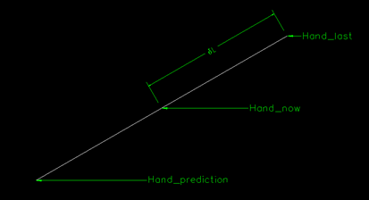
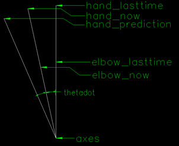
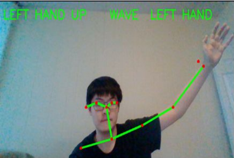
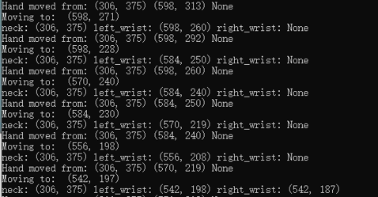

# Readme

This repository contains:

1. my project main file name: openpose.py, and openposedemo.py and openpose_method1.py and openpose_method2.py
2. A bat file to download models from CMU
3. A txt file record how to run the python document
4. two sample document from CMU
5. two method to use model

# Background 

Nowaday, human recognition is a popular application for the development of computer science and artificial intelligence, such as human computer interaction, security and surveillance, shopping experience analysis and health care. People train some model of human activities for computers to let them recognize different actions.   

Human recognizations can be used in many different situations. For example, there are many shopping malls with surveillance cameras. It can record what people are doing, and some people raise an idea about that if we can judge some danger action from humans before it happens. For example, if a person is glancing right and left, and always wants to see other’s pockets, the experienced police may judge the people as a thief. Can we repeat this process by an AI decision maker? 

# Approach

 I tried to finish the project as following three steps: (1) recognize static action of human, (2) recognize dynamic action of human, (3) make predictions about the dynamic action. I will focus on how to recognize dynamic action and make predictions in my project.

Static action:If both hands are higher than the location of the person’s neck, then output “BOTH HANDS UP”, else if only one hand is higher than the location of the person’s neck, then output ”LEFT HAND UP” or “RIGHT HAND UP”.

Dynamic action:For dynamic action, we need two photos with a very short time interval as δt, then we need to make a judgement about whether the human in photos has moved. I assume the location of the key body part is S, and the change of S in these two pictures is δS. If the δS is not equal to zero, that means the key body part moved, then we could use the information to make judgments.  

For example, for the static action, I am hand up, and for the next second, the location of my hand changes, but still higher than my neck. Then the algorithm could make a judgment that I am waving my hands.

However, sometimes I am not going to wave my hand but the algorithm still says that I am waving my hand. So I add a limitation for δS, only if the change of my hand’s location is bigger than a range then the algorithm will judge this as a dynamic action. 

Prediction: Include two method  

# Quick Start

To run my code you need:  
1.python3+(python2.7 should be ok)  
2.install opencv for my preoject file  
3.download model from CMU:https://github.com/CMU-Perceptual-Computing-Lab/openpose or use getModels.bat for Windows  
4.use the command in python.txt  

# Result:

# Reference:
[1] Zhe Cao, Gines Hidalgo, Tomas Simon, Shih-En Wei, Yaser Sheikh, “OpenPose: Realtime Multi-Person 2D Pose Estimation using Part Affinity Fields,” in 2018.  
[2] G. Hidalgo, Z. Cao, T. Simon, S.-E. Wei, H. Joo, and Y. Sheikh, “OpenPose library,” https://github.com/ CMU-Perceptual-Computing-Lab/openpose.  
[3] P. F. Felzenszwalb and D. P. Huttenlocher, “Pictorial structures for object recognition,” in IJCV, 2005.  
[4] ——, “Pictorial structures revisited: People detection and articulated pose estimation,” in CVPR, 2009.  
[5] V. Belagiannis and A. Zisserman, “Recurrent human pose estimation,” in IEEE FG, 2017.  
[6] X. Qian, Y. Fu, T. Xiang, W. Wang, J. Qiu, Y. Wu, Y.-G. Jiang, and X. Xue, “Pose-normalized image generation for person reidentification,” in ECCV, 2018.  

